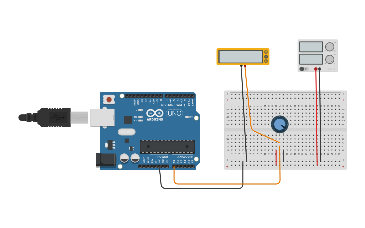

# Arduino Analog Read Example

This code is simulated in the tinkerCAD, an Explanation video is avilable in YouTube.

## Youtube Video [This Link](https://www.youtube.com/watch?v=cNae7twyCl8&t=249s)

## tinkerCAD Simulation [This Link](https://www.tinkercad.com/things/1acuMQJQXoc)
